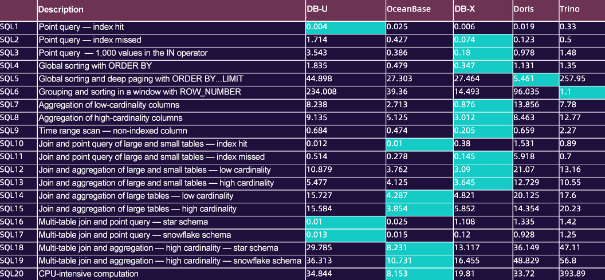
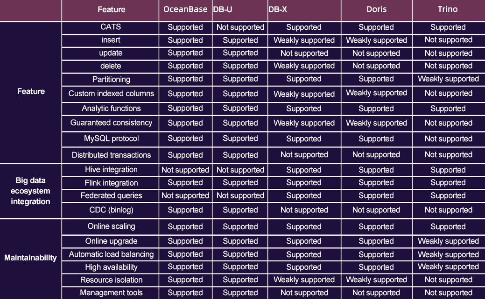
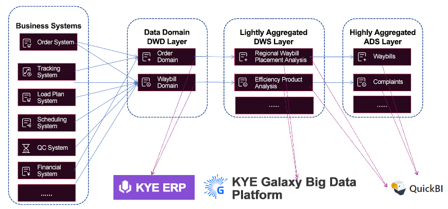

---
slug: KYE
title: 'Handling over 10 million daily API calls with an ultra-low query latency: A real-time analytical solution of KYE based on Flink and OceanBase'
tags:
  - User Case
---

About the author: Bao Guiming, Senior Big Data Engineer at KUAYUE EXPRESS (KYE), works on the research and introduction of real-time data R&D platforms and data lakes. Focusing on advancing the best practices and solutions of real-time/offline data warehouse architectures, Bao is committed to providing his company with accessible and efficient big data infrastructure systems, such as real-time computing systems and data lakes.

<!-- truncate -->

I. Waybill query requiring real-time data processing
-----------------

Founded in 2007, KYE is now an influential comprehensive express service provider in China's logistics industry. As consumers' shopping habits change with the growing domestic economy, the country's logistics industry has embraced explosive demand. So far, KYE has extended its service to 99% of the cities in China and serves more than 1 million enterprises every year. More than 100 business insight (BI) analysts utilize different service modules of our company's big data platform for their daily data research and development.

KYE's data services involve more than 10,000 APIs, which are called over 10 million times on a daily basis. What's great is that our big data platform handles 99% of the queries with a latency of less than 1 second, offering a smooth query experience for 60,000 employees. In this article, I will walk you through our real-time analytical solution based on Flink and OceanBase Database.  
It is a well-known fact in the logistics industry that essential data analysis is centered on waybills. A waybill, from its placement to settlement, goes through dozens of business systems on the entire logistics chain. In this process, we need to integrate the basic fields of these business systems, and build a waybill domain in our data warehouse using complex joins and hierarchical calculations, so that the waybill domain can be used by various services through the big data platform.

In the early days, we aggregated data using single-table queries with fixed dimensions to support users' point queries based on specific criteria. Even if a single table with tens of millions of rows was batch updated offline, many users were still okay with a service query response in seconds.

As the competition in the logistics market intensifies, however, users are expecting more efficient data queries and service responses. Taking waybill analysis as an example, to meet users' query requirements, a system needs to update a data table with more than 100 million rows in real time, respond to a query in sub-seconds, and support the aggregation of any metrics and fields after multi-table joins.

So, to improve user experience, KYE requires a database system that:

* Delivers ultimate query performance
* Works with a stable computing engine
* Supports real-time operations such as data write and update
* Features ease of use, supporting standard SQL statements and a variety of functions, backed by an active community, and preferably highly compatible with the MySQL protocol
* Supports multiple types of data sources, ensuring smooth data read/write in various scenarios

II. Considerations in selecting a real-time computing engine and a database service
-------------------

Given the aforesaid requirements, we should figure out a solution based on a real-time computing engine and a powerful database service.

i. Selection and comparison test of real-time computing engines

We compared three mainstream real-time computing frameworks, namely Storm, Spark Streaming, and Flink. The figure below shows that both Storm and Flink control the data latency within milliseconds. However, Flink has the edge in terms of state management, unified batch and stream processing, data integration ecosystem, and ease of use. Therefore, Flink was our first choice for computing architecture.

ii. Selection of database services based on business-specific custom benchmark standards

We started database service selection right after deciding on the computing engine. The question was, how to pick a suitable one? We compared the results of popular benchmark tests in the industry, such as TPC-H, TPC-DS, and Star schema benchmarks (SSB), and investigated case studies published on the official websites of database vendors.

Considering that vendors would optimize their products based on their actual business scenarios during testing, we did not rely fully on the published information. Instead, based on our specific business analysis needs, we came up with custom benchmark standards, including unified test servers and testing environment, standard data sets and standard SQL statements based on actual waybill analysis scenarios, and feature test sets based on our needs.  
Then, we tested and compared the query performance of DB-U (a distributed HTAP database), OceanBase Database, DB-X (a real-time analytical database), Doris, and Trino. In the test, the databases were deployed on three servers, each with 32 CPU cores and an SSD of 128 GB, and the largest test table contained 100 million rows with 35 GB of data. OceanBase Database and DB-X exhibited better performance, as shown in the figure below.

iii. Settling on OceanBase Database after comprehensive consideration

After testing the query performance, we compared the candidate databases in terms of common features, big data ecosystem integration, and maintainability. The results are shown in the figure below. OceanBase Database supports various features except for Hive integration and federated queries. Although DB-X, Doris, and Trino performed better in big data ecosystem integration, it seems that they are not as maintainable as OceanBase Database.

Then, we compared the data write performance of OceanBase Connector, Java Database Connectivity (JDBC) Connector, and DB-X Connector. With the degree of parallelism (DOP) set to 10, OceanBase Connector wrote 10 million rows of 280 fields in 10 minutes. Such write speed is roughly the same as that of DB-X Connector, but about two times faster than that of JDBC Connector. These test results further proved the advantages of OceanBase Database in terms of database connectivity and data processing performance.

Factoring in the results of query performance testing, supported features, and write performance testing, we believed that OceanBase Database fit our expectations more than others. Its HTAP capabilities and user-friendly O&M management platform finally made us decide to use OceanBase Database to tackle the challenges in real-time analytics.

* HTAP capabilities: Back then, our business systems relied on MySQL databases in handling online transactional processing (OLTP) tasks and a DB-X database for online analytical processing (OLAP) tasks, but transactions and real-time analytical requests must be processed concurrently in many of our business scenarios. Real-time waybill analysis, for example, requires the system to write, update, and analyze data in real time. OLTP and OLAP tasks can be handled in one OceanBase cluster without affecting each other, which aligns with our business needs just right.
* User-friendly O&M management platform: If a database needs to be managed and monitored by a CLI or a self-developed GUI-based platform, the database is complex and incurs high costs. DB-U and OceanBase Database both come with an O&M platform. The latter supports hybrid row-column storage and compresses data with a high compression ratio, saving storage costs greatly, while the former adopts a more complex architecture and doesn't support hybrid row-column storage, requiring a storage space of two times that of the latter.

We quickly implemented the new architecture soon after settling on the Flink + OceanBase solution.

III. Application of Flink and OceanBase Database in real-time waybill analysis
--------------------------------

The following figure shows the logic of our real-time waybill processing public layer. You can see that the business data is processed by a series of systems such as the order, tracking, load plan, scheduling, quality control, and financial systems, undergoes the aggregation of basic fields and complex join calculations, and is written in real time into the wide table in the waybill domain of the data warehouse detail (DWD) layer and stored in OceanBase Database. Then, the data can be analyzed and queried by KYE ERP through the big data platform.

With the help of OceanBase Change Data Capture (CDC) and the state management feature of Flink, we perform hierarchical calculations and lightly aggregate the data at the data warehouse summary (DWS) layer to analyze the data tables of time-sensitive services in the last 15 days and the cargo volume of each route. Users can query the aggregated data by using the data access service of our big data platform.

The statistical tables of the lightly aggregated 15-day service data are then highly aggregated at the application data service (ADS) layer to provide inputs for statistical indicators, such as the fill rate in the last seven days and the number of complaints of the current day. Indicators are fed to QuickBI to create a visual data dashboard, presenting the data clearly in real time.

i. Challenges in building the real-time waybill processing public layer

The following challenges were inevitable when building the real-time waybill processing public layer:

* Diverse data sources. We need to join tables of various business modules into a wide table in real time.
* Highly time-sensitive data. Despite varying data requirements, we should process data as fast as possible.
* Data reuse. Data from the public layer would be provided to the downstream applications for real-time labeling and hierarchical calculations in a data warehouse.

We researched into real-time wide table solutions, and came up with the following 4 methods based on our findings:

* Use Flink to perform join operations. Flink supports one-to-many joins. However, we must set the state time-to-live (TTL) reasonably because the large state affects the data processing performance significantly.
* Perform partial column updates in HBase, which supports data joins. In this case, highly concurrent real-time writes and efficient random reads are possible based on the row key. The CDC service is required to synchronize the incremental data to the downstream applications for OLAP analysis.
* Perform partial column updates in StarRocks, which supports both data joins and analysis. The downside is that it joins data only based on the same primary key and does not support CDC.
* Perform partial column updates in OceanBase Database, which resolves the CDC compatibility issues of the preceding method.

Based on the preceding real-time wide table solution, we built our real-time waybill analytics architecture 1.0 (hereinafter referred to as architecture 1.0).

ii. Optimization of the real-time waybill analytics architecture

Generally, architecture 1.0 implements a real-time wide table in five steps.

Step 1: Data source configuration and listening. Canal is deployed to listen for the MySQL business databases. Data changes are captured and transferred to Kafka in real time.

Step 2: Data integration and wide table construction. A Flink SQL task is scheduled to read data from Kafka and write data into HBase data tables. Then, partial column updates are performed to build a wide table.

Step 3: Configuration of the HBase CDC service to write data changes to Kafka in real time.

Step 4: Real-time data updates. Another Flink SQL task is scheduled to read the incremental data of the wide table in Kafka in real time and then write the data to DB-X to keep the wide table updated in real time.

Step 5: Use and query of data. External applications can use the wide table data updated in the previous steps through the big data platform.

Architecture 1.0 avoids large state multi-stream joins by Flink, allowing the system to process data more efficiently with a reduced workload. It also improves data timeliness and analysis performance, cutting the overall data processing duration to less than 20 seconds and data analysis duration to less than 3 seconds, providing users with faster and more efficient data analysis services.

However, we must develop a custom HBase CDC service on our own, and invest more resources in maintenance and updates. This increases R&D costs and architectural complexity, and makes troubleshooting difficult. Further, it involves the integration of multiple components and technologies, which requires regular updates, optimization, and troubleshooting, resulting in higher maintenance costs.

Therefore, we have upgraded it to the real-time waybill analytics architecture 2.0 (hereinafter referred to as architecture 2.0).

From the preceding figure, you may have noticed some changes in the implementation logic. In Step 1, Canal is deployed to listen for the MySQL business databases. The binlogs generated are written to Kafka. In Step 2, Flink SQL tasks are scheduled to read data from Kafka. The table fields with the same primary key from different modules are written to OceanBase Database. By now, a real-time waybill wide table is already built, and can be directly used by services of the big data platform. In Step 3, OceanBase CDC and the Flink state management feature are used to perform hierarchical calculations. Then, results are aggregated and classified, written to OceanBase Database, and provided for various services of the big data platform based on specific business requirements.

The optimized architecture 2.0 brings great benefits:

* Higher data timeliness. Overall, architecture 2.0 is 5 to 15 seconds faster than architecture 1.0.
* Simpler links and easier troubleshooting. Architecture 1.0 comes with complex links, which makes troubleshooting difficult, while architecture 2.0 contains only Flink and OceanBase Database, making troubleshooting much easier.
* A modern data architecture, reducing cluster costs by about 50%. Having an HBase cluster, architecture 1.0 writes data to Kafka twice more, and writes one more data copy to DB-X. Architecture 2.0 requires only a OceanBase cluster, reducing costs significantly.

IV. Expectations on OceanBase efficiency improvement
---------------

We will do the following jobs to optimize our analytics architecture:

* Try to replace Canal with MySQL CDC. MySQL CDC tracks and records data changes in real time, reducing the delay and complexity of data synchronization. If we can replace Canal with MySQL CDC, we can capture and process data changes more efficiently.
* Use OceanBase Database to store the real-time data of dimension tables. OceanBase Database features high performance, high availability, and high scalability. Using it to store the real-time data of dimension tables can improve query efficiency and data consistency.
* Migrate some MySQL-based TP tasks to OceanBase Database. OceanBase Database shows better performance in distributed transaction processing. We can make use of this advantage to improve system throughput and concurrency.

To improve development performance based on OceanBase Database, we also plan to:

* Integrate our real-time computing platform with OceanBase Catalog. This way, real-time computing tasks can be better managed and scheduled to improve development efficiency and resource utilization.
* Integrate the data lineage capabilities of Flink SQL into OceanBase Database to track data forwarding and processing, and improve data governance and O&M efficiency.
* Connect internal data platforms to OceanBase data sources to achieve unified data management and sharing, smooth data flow to and from various sources, and higher data availability and utilization.